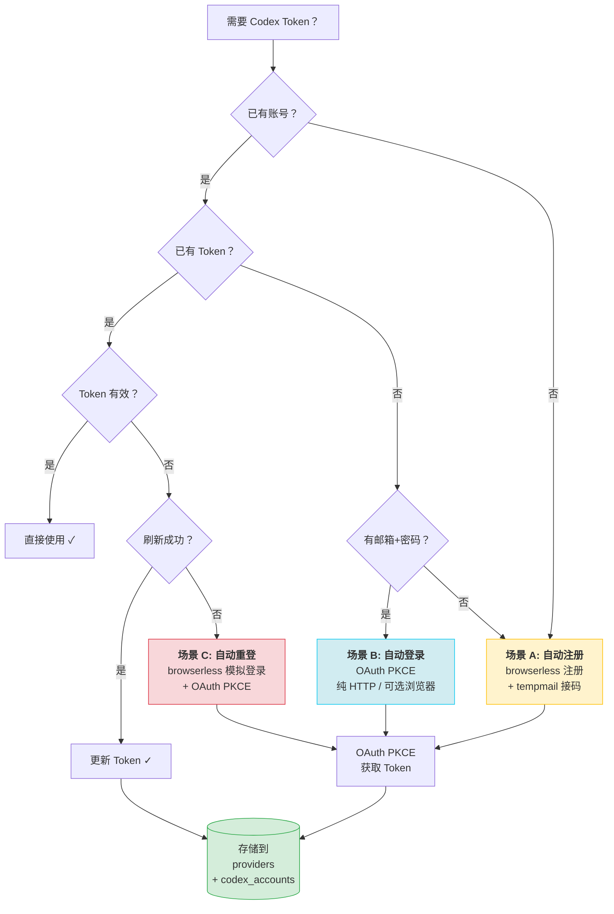
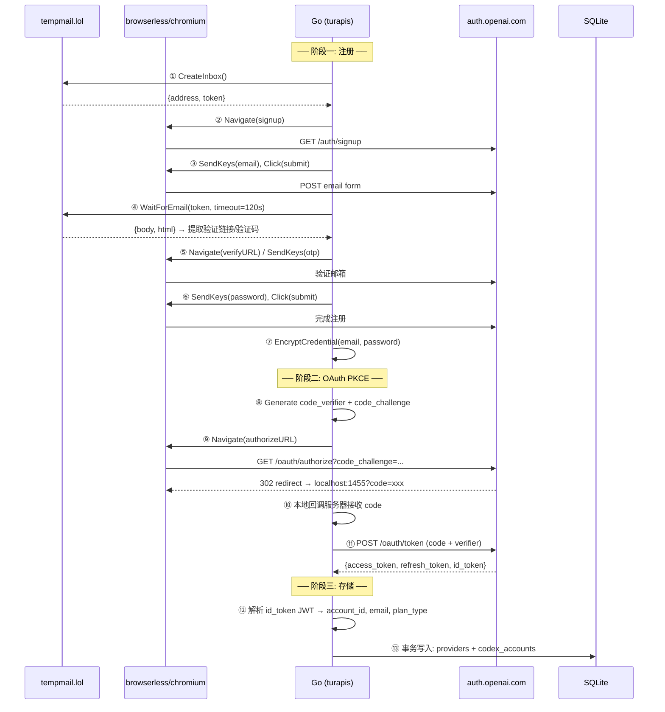
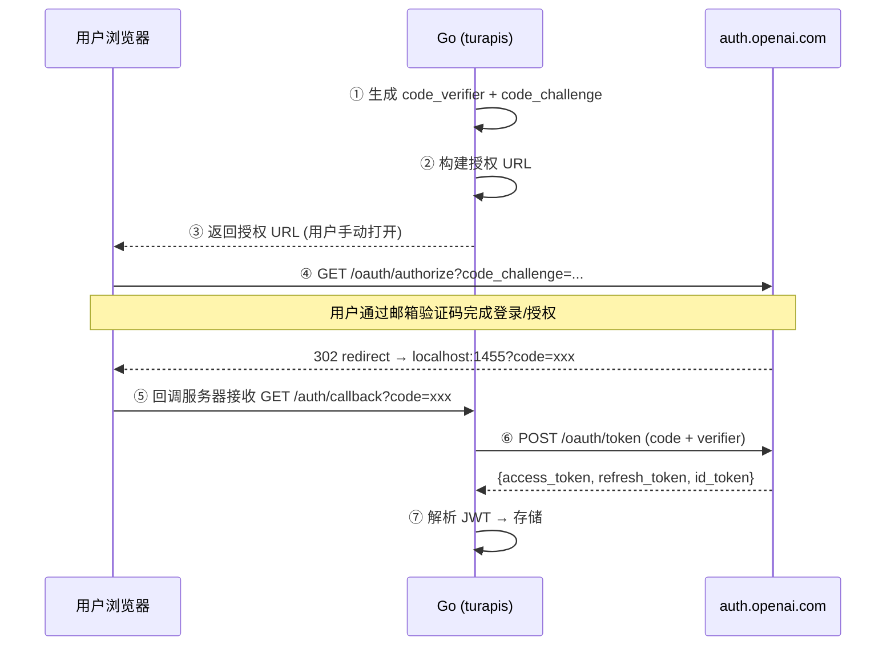
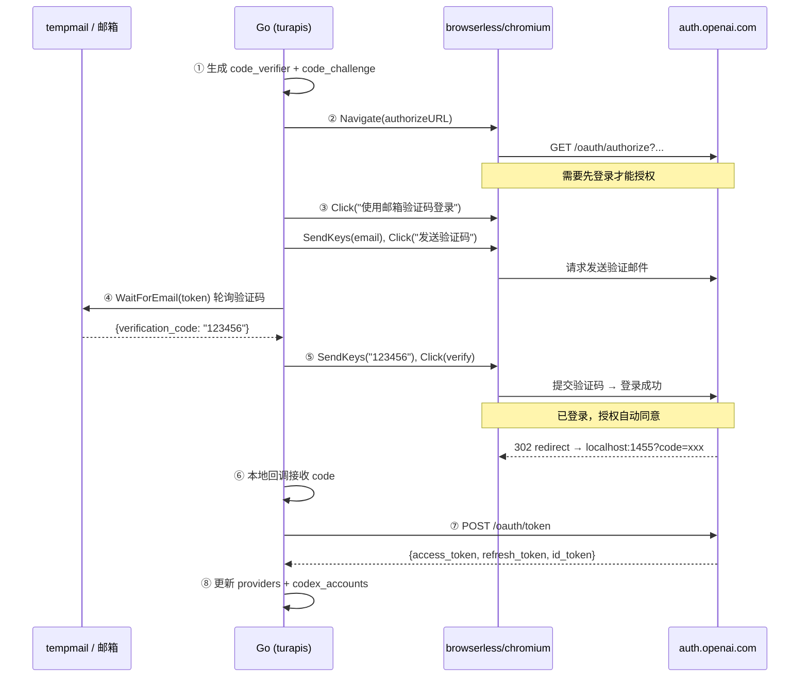
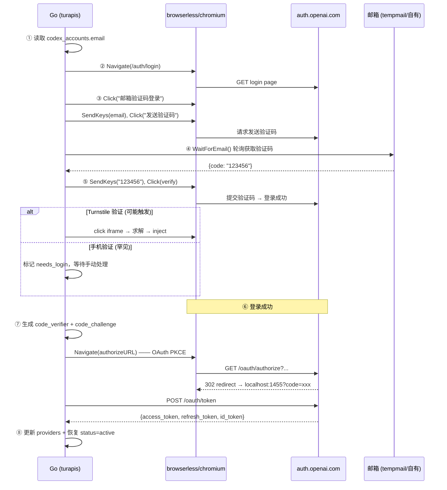
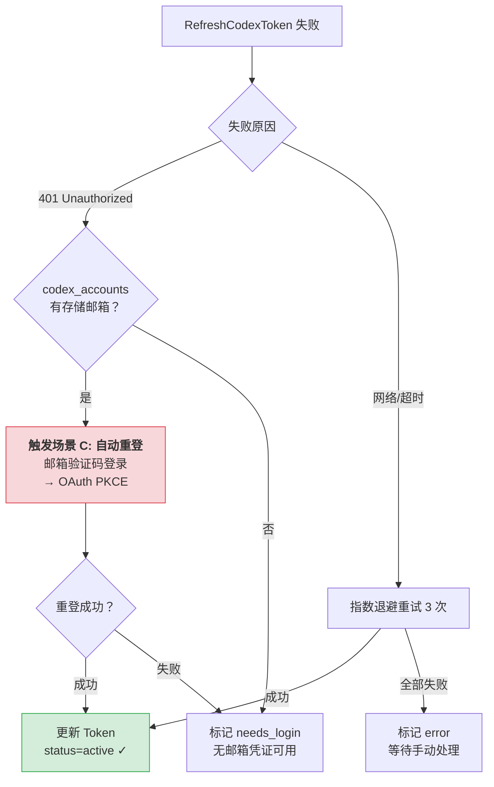

# Codex 自动登录/注册接入 — 详细实现计划

> **状态**: Wave 1 ✅ | Wave 2 ✅ | mailondeck_browserless ✅ | Wave 3-8 计划中  
> **语言**: Go 1.26（后端）+ TypeScript/React 19（前端）  
> **目标**: 在 turapis 项目中搭建 Codex 账号自动注册和自动登录的完整架子，支持：
> - **自动注册**：tempmail.lol / emailondeck.com 接码 + browserless/chromium 浏览器自动化创建全新账号
> - **自动登录**：OAuth PKCE 获取已有账号的 Token（无需浏览器），以及过期后凭据重登（browserless 模拟登录）

---

## 目录

- [1. 参考资料](#1-参考资料)
- [2. 现状分析](#2-现状分析)
- [3. 实现原理](#3-实现原理)
  - [3.1 场景总览：注册 vs 登录](#31-场景总览注册-vs-登录)
  - [3.2 自动注册流程](#32-自动注册流程)
  - [3.3 自动登录流程（已有账号）](#33-自动登录流程已有账号)
  - [3.4 自动重登流程（Token 过期恢复）](#34-自动重登流程token-过期恢复)
  - [3.5 为什么用本地回调服务器](#35-为什么用本地回调服务器)
  - [3.6 OAuth PKCE 详解](#36-oauth-pkce-详解)
  - [3.7 Codex OAuth 客户端参数](#37-codex-oauth-客户端参数)
  - [3.8 JWT id_token Claims 提取](#38-jwt-id_token-claims-提取)
  - [3.9 Token 刷新与重登决策](#39-token-刷新与重登决策)
  - [3.10 凭证加密存储（AES-256-GCM）](#310-凭证加密存储aes-256-gcm)
  - [3.11 反检测策略](#311-反检测策略)
- [4. 架构设计](#4-架构设计)
- [5. 详细实现计划](#5-详细实现计划)
- [6. 文件清单](#6-文件清单)
- [7. 依赖图](#7-依赖图)
- [8. 风险与缓解](#8-风险与缓解)
- [9. 验证策略](#9-验证策略)
- [10. 环境要求](#10-环境要求)

---

## 1. 参考资料

### 参考项目

| 项目 | 仓库 | 核心借鉴 | 语言 |
|------|------|----------|------|
| **codex-auth** | [Loongphy/codex-auth](https://github.com/Loongphy/codex-auth) | `~/.codex/auth.json` 解析、JWT claims 提取、多账号注册表（registry）模式、复合键 `{user_id}::{account_id}` | Zig |
| **chatgpt2api** | [basketikun/chatgpt2api](https://github.com/basketikun/chatgpt2api) | 完整自动注册流程（邮箱→OTP→创建账号→获取 token）、后台刷新线程、账号池轮询、curl_cffi TLS 指纹伪装、PoW sentinel token 求解 | Python |
| **any-auto-register** | [lxf746/any-auto-register](https://github.com/lxf746/any-auto-register) | Playwright/Camoufox 浏览器自动化、OAuthBrowser 多模式封装（CDP/Profile/Plain）、三层 Turnstile 求解、DDD 插件架构、生命周期管理器 | Python |
| **metapi** | [cita-777/metapi](https://github.com/cita-777/metapi) | **本地回调服务器**（loopback HTTP server）接收 OAuth 回调、PKCE S256 标准流程、singleflight 刷新去重、AES-256-GCM 凭证加密、手动回调 URL 降级模式（headless 环境适配） | TypeScript |

### 外部服务

| 服务 | 用途 | API / 端点 | 认证方式 | 复用邮箱 |
|------|------|------------|----------|:---:|
| **tempmail.lol** | 临时邮箱（免费层） | `POST /v2/inbox/create` → `{address, token}`<br>`GET /v2/inbox?token=<token>` → `{emails}` | inbox token | ❌ |
| **emailondeck.com** | 临时邮箱（旧域名，AJAX API，**支持免费复用**，无 CAPTCHA） | `GET /ajax/ce-new-email.php` → `地址\|token`<br>`POST /ajax/messages.php` → 消息列表 HTML<br>`GET /email_iframe.php?msg_id=` → 邮件内容<br>**Change Email**: 设置相同 alias+domain → 复用历史邮箱 | session cookie | ✅ 历史邮箱复用 |
| **mailondeck.com** | 临时邮箱（新域名，Laravel + reCAPTCHA，需 browserless） | 启用 reCAPTCHA 保护，需浏览器自动化交互 | session + CAPTCHA | ✅（但需浏览器） |
| **EmailOnDeck PRO** | 临时邮箱（付费 API） | `api.emailondeck.com/api.php?token=KEY&act=create_email` | API key（付费） | ✅ |
| **browserless/chromium** | Docker 无头 Chrome | `ws://localhost:3000/chromium?token=xxx` | URL token | — |
| **chromedp** | Go CDP 客户端 | `github.com/chromedp/chromedp` | — | — |

### 多供应商 EmailProvider 接口设计

```go
// internal/email/provider.go

type EmailMessage struct {
    ID      string `json:"id"`
    From    string `json:"from"`
    Subject string `json:"subject"`
    Body    string `json:"body"`    // plain text
    HTML    string `json:"html"`    // raw HTML
    Date    int64  `json:"date"`    // unix millis
}

type InboxInfo struct {
    Address  string `json:"address"`
    Provider string `json:"provider"` // "tempmail_lol" | "mailondeck" | "emailondeck_pro"
    Token    string `json:"token"`    // provider-specific auth
    Extra    map[string]string `json:"extra"` // provider-specific data (cookies, etc.)
}

type EmailProvider interface {
    // CreateInbox 创建一个新邮箱（随机地址）
    CreateInbox() (*InboxInfo, error)

    // CreateInboxWithAlias 创建/复用指定别名的邮箱
    // 对于 mailondeck.com：设置相同的 alias+domain 即可复用历史邮箱
    // 对于 tempmail.lol（免费层）：不支持，返回错误
    CreateInboxWithAlias(alias, domain string) (*InboxInfo, error)

    // GetMessages 获取邮箱中的所有邮件
    GetMessages(inbox *InboxInfo) ([]EmailMessage, error)

    // GetMessage 获取单封邮件的完整内容
    GetMessage(inbox *InboxInfo, messageID string) (*EmailMessage, error)

    // WaitForEmail 等待新邮件到达
    WaitForEmail(inbox *InboxInfo, timeout time.Duration, predicate func(*EmailMessage) bool) (*EmailMessage, error)

    // SupportsReuse 是否支持复用已有邮箱
    SupportsReuse() bool

    // Name 返回供应商名称
    Name() string
}

// 邮件验证码/链接提取（共享工具函数）
func ExtractVerificationCode(msg *EmailMessage) string
func ExtractVerificationLink(msg *EmailMessage) string
```

---

## 2. 现状分析

### 2.1 turapis 现有 Codex 能力

| 能力 | 状态 | 位置 |
|------|------|------|
| Codex Site 模板 | ✅ 已有（id=4） | `internal/config/store.go:SeedBuiltinSites()` |
| OAuth 凭证存储 | ✅ `providers.api_key` JSON | 格式: `{"tokens":{"access_token":"...","refresh_token":"...","id_token":"..."}}` |
| Token 刷新 | ✅ 手动触发 | `internal/provider/oauth_refresh.go:RefreshCodexToken()` |
| Raw 代理穿透 | ✅ JWT 检测 + 原始代理 | `internal/gateway/auth.go`, `responses.go` |
| Codex CLI 检测 | ✅ User-Agent 正则 | `internal/provider/openai/provider.go` |
| 配额探测 | ✅ x-codex-* header 解析 | `internal/provider/quota.go` |
| 批量导入脚本 | ✅ Python 脚本 | `data/import_codex_oauth.py` |
| **自动登录（获取初始 token）** | ❌ **缺失** | — |
| **多账号管理** | ❌ **缺失** | — |
| **定期健康检查** | ❌ **缺失** | — |

### 2.2 核心缺口

turapis 目前**只能手动导入** OAuth token（通过 admin API 或 Python 脚本），缺少：

1. **自动获取初始 Token**的能力——无自动注册/登录流程
2. **多账号管理**——无账号元数据追踪（邮箱、状态、过期等）
3. **后台生命周期管理**——无定期刷新、健康检查、自动导入

---

## 3. 实现原理

### 3.1 场景总览：注册 vs 登录

本系统覆盖 Codex 账号的**三种典型场景**：

| 场景 | 适用条件 | 需要 browserless | 需要 tempmail | 说明 |
|------|----------|:---:|:---:|------|
| **A. 自动注册** | 无任何账号，需从零创建 | ✅ | ✅ | 完整的新账号注册 + 获取 Token |
| **B. 自动登录** | 已有 ChatGPT 账号（知道邮箱密码），仅缺 Token | ❌ 可选 | ❌ | OAuth PKCE 纯 HTTP 流程获取 Token |
| **C. 自动重登** | 已有账号 + 已存 Token，但 Token 过期且不可刷新 | ✅ | ❌ | 用存储的密码模拟登录，重新获取 Token |



### 3.2 自动注册流程（场景 A）

**条件**：无任何 ChatGPT/Codex 账号，需要从零创建。



### 3.3 自动登录流程（场景 B）——已有账号，只需获取 Token

**条件**：已有一个 ChatGPT 账号（知道邮箱），但没有 Token 或 Token 已过期。

**核心思路**：**掌握邮箱 = 掌握账号**。只要能接收验证码，就不需要密码——通过邮箱验证码登录，然后 OAuth PKCE 获取 Token。

#### 路径 B1：用户手动浏览器授权（无 browserless / 无密码）



**适用场景**：
- 开发者有 ChatGPT 账号，手动在浏览器登录即可
- 不需要全自动化的环境
- 部署在本地开发机

#### 路径 B2：邮箱验证码自动登录（browserless + 邮箱接码）

**前提**：已有账号的邮箱（可以是真实邮箱或 tempmail 临时邮箱），通过邮件接收验证码，无需密码。



**适用场景**：
- 邮箱可控（tempmail 或自有邮箱），无需密码
- 全自动化登录

**关于 browserless 容器内回调到宿主机**：
browserless Docker 容器内的 `localhost` 指向容器自身，不是宿主机。因此路径 B2 需要额外处理：
- **方案 1**：在 browserless 中 navigates 时将 `redirect_uri` 替换为宿主机可访问的地址（如 `host.docker.internal:1455`）
- **方案 2**：不让 browserless 发起 redirect——改为在浏览器中拦截重定向 URL（用 chromedp 的 `ListenTarget` 监听导航事件），在 Go 代码中提取 `code` 参数
- **方案 3**（推荐）：使用 chromedp 的 `chromedp.ActionFunc` + `chromedp.Location` 在页面即将导航前捕获目标 URL

### 3.4 自动重登流程（场景 C）——Token 彻底过期后恢复

**条件**：已有账号 + 邮箱可控（可接收验证码），但 Token 已过期且 refresh_token 也无法使用。

**核心思路**：浏览器导航到登录页 → 选择"邮箱验证码登录" → 邮箱接收验证码 → 登录 → OAuth PKCE 获取新 Token。**全程不需要密码**。

**触发时机**（在 `refreshRoutine` 中检测）：
1. `provider.RefreshCodexToken()` 失败（refresh_token 已过期/被吊销）
2. `healthCheckRoutine` 检测到 Token 不可用（401/403）
3. 管理员手动触发「重登」



**与自动注册的关键区别**：

| | 自动注册（场景 A） | 自动登录（场景 B1/B2） | 自动重登（场景 C） |
|---|---|---|---|
| 邮箱 | tempmail.lol 临时邮箱 | 用户已有邮箱 | **新 tempmail 邮箱**（旧邮箱已过期） |
| 密码 | **不需要**（验证码） | **不需要**（验证码） | **不需要**（验证码） |
| 导航页面 | `/auth/signup` | `/oauth/authorize` | `/auth/signup`（等价于场景 A） |
| 认证方式 | 邮箱验证码 | 手动授权 / 验证码 | 邮箱验证码 |
| browserless | ✅ 必须 | ❌ 可选（B2 需要） | ✅ 必须 |

> **重要**：在 tempmail.lol 免费层（1 小时有效期）下，场景 C（重登）实际上等价于场景 A（注册）——旧邮箱已过期，需要全新注册。

### 3.5 为什么用「本地回调服务器」而不是「拦截浏览器重定向」

metapi 项目证明了：**不需要在浏览器中拦截 OAuth 重定向 URL**。标准 OAuth PKCE 流程中，授权服务器会将用户重定向到 `redirect_uri`。如果 `redirect_uri` 设置为 `http://localhost:1455/auth/callback`，浏览器的重定向请求会直接到达本地 HTTP 服务器，从中提取 `code` 参数即可。

| 方案 | 可靠性 | 复杂度 |
|------|--------|--------|
| 拦截浏览器 URL（chromedp 监听） | ⚠️ 需处理多种重定向情况 | 高 |
| **本地回调服务器（metapi 方案）** | ✅ 标准 OAuth 流程 | 低 |

**metapi 还提供了「手动回调 URL」降级方案**：在 headless/Docker 环境下，用户手动复制浏览器地址栏中的回调 URL，粘贴到 API 端点。这确保了在无法使用本地浏览器时也能完成授权。

### 3.6 OAuth PKCE 详解

PKCE（Proof Key for Code Exchange）是 OAuth 2.1 推荐的安全扩展，防止授权码拦截攻击。

```
客户端（Go）                              授权服务器（auth.openai.com）
    │                                              │
    │ ① 生成 code_verifier（随机43字符）              │
    │ ② code_challenge = SHA256(code_verifier)      │
    │                                              │
    │ ③ GET /oauth/authorize?                      │
    │    client_id=app_EMoamEEZ73f0CkXaXp7hrann     │
    │    response_type=code                        │
    │    redirect_uri=http://localhost:1455/...     │
    │    code_challenge=<challenge>                │
    │    code_challenge_method=S256                │
    │    scope=openid+email+profile+offline_access │
    │ ─────────────────────────────────────────────►│
    │                                              │ ④ 用户完成授权（已登录则自动）
    │ ⑤ 本地回调服务器收到重定向                       │
    │ ←─────────────────────────────────────────────│
    │    GET /auth/callback?code=xxx&state=yyy      │
    │                                              │
    │ ⑥ POST /oauth/token                          │
    │    grant_type=authorization_code             │
    │    code=<authorization_code>                 │
    │    code_verifier=<原始verifier>               │
    │ ─────────────────────────────────────────────►│
    │                                              │ ⑦ 验证 verifier 与 challenge 匹配
    │ ←─────────────────────────────────────────────│
    │    {access_token, refresh_token, id_token}    │
```

### 3.7 Codex OAuth 客户端参数

| 参数 | 值 | 来源 |
|------|-----|------|
| `client_id` | `app_EMoamEEZ73f0CkXaXp7hrann` | 已有的 `oauth_refresh.go` 和 metapi 分析 |
| `redirect_uri` | `http://localhost:1455/auth/callback` | metapi codexProvider |
| `scope` | `openid email profile offline_access` | metapi codexProvider |
| `code_challenge_method` | `S256` | PKCE 标准 |
| 附加参数 | `prompt=login`, `codex_cli_simplified_flow=true` | metapi codexProvider |

### 3.8 JWT id_token Claims 提取

```go
// id_token 是 JWT 格式: header.payload.signature
// payload 编码: base64url
type CodexJWTClaims struct {
    Email string `json:"email"`
    Auth  struct {
        ChatGPTAccountID string `json:"chatgpt_account_id"`
        ChatGPTPlanType  string `json:"chatgpt_plan_type"`
    } `json:"https://api.openai.com/auth"`
}
```

| Claim | 用途 |
|-------|------|
| `email` | 账号标识、显示名 |
| `https://api.openai.com/auth.chatgpt_account_id` | 唯一账号 ID，用作数据库唯一键 |
| `https://api.openai.com/auth.chatgpt_plan_type` | 订阅类型（`free`/`plus`/`pro`/`team`/`business`/`enterprise`/`edu`） |

### 3.9 Token 刷新与重登决策

沿用现有的 `provider.RefreshCodexToken()`:

```
POST https://auth.openai.com/oauth/token
Content-Type: application/x-www-form-urlencoded

grant_type=refresh_token
&client_id=<从 access_token JWT 中提取>
&refresh_token=<存储的 refresh_token>
```

**注意事项**（OAuth 2.1）:
- Refresh token 是**一次性**的，每次刷新返回新的 refresh_token
- 必须**使用后立即更新**存储，防止旧的 refresh_token 丢失导致账号不可用
- 使用 singleflight 模式防止并发刷新同一账号

#### 刷新失败后的重登决策树

当 `RefreshCodexToken()` 失败时，不是简单标记为 "expired"，而是根据是否有存储凭证决定下一步：



**决策核心逻辑** (`internal/codexauth/lifecycle.go`):

```go
func (m *LifecycleManager) refreshWithFallback(ctx context.Context, account *CodexAccount) error {
    // 1. 尝试 OAuth token 刷新
    err := provider.RefreshCodexToken(m.store, account.ProviderID, "")
    if err == nil {
        m.registry.UpdateLastRefresh(account.ID)
        return nil
    }

    // 2. 刷新失败，检查是否有存储的邮箱凭证
    emailCred := m.getEmailCredential(account.ID)
    if emailCred == nil {
        // 无邮箱凭证，标记为 needs_login
        m.registry.UpdateStatus(account.ID, StatusNeedsLogin, 
            fmt.Sprintf("refresh failed and no email credential: %v", err))
        return err
    }

    // 3. 有邮箱凭证 → 触发自动重登（场景 C：邮箱验证码登录）
    slog.Info("triggering auto-relogin via email code", "account_id", account.AccountID)
    return m.autoReloginWithEmail(ctx, account, emailCred)
}

func (m *LifecycleManager) autoReloginWithEmail(ctx context.Context, account *CodexAccount, emailCred *EmailCredential) error {
    bctx, cancel := m.browser.NewContext()
    defer cancel()

    // ① browserless 模拟邮箱验证码登录
    if err := m.browser.RunEmailCodeLogin(bctx, emailCred.Email, emailCred.Token); err != nil {
        m.registry.UpdateStatus(account.ID, StatusNeedsLogin, 
            fmt.Sprintf("auto-relogin failed: %v", err))
        return err
    }

    // ② OAuth PKCE 获取新 Token
    tokens, err := m.flow.RunOAuthOnly(bctx)
    if err != nil {
        return err
    }

    // ③ 更新
    credJSON, _ := TokenSetToCredentialJSON(tokens)
    m.store.UpdateProviderCredential(account.ProviderID, credJSON)
    m.registry.UpdateLastRefresh(account.ID)
    m.registry.UpdateStatus(account.ID, StatusActive, "")
    return nil
}
```

### 3.10 邮箱凭证存储

**核心原则**：掌握邮箱 = 掌握账号。不需要存储密码——邮箱收件箱本身就是最强认证因子。

**存储模型**：

```go
// internal/codexauth/credentials.go

// 邮箱凭证（极简模型——只需要邮箱地址）
type EmailCredential struct {
    Email     string `json:"email"`      // 账号邮箱
    Provider  string `json:"provider"`   // email 提供商: "tempmail" | "gmail" | "outlook" | ...
    Token     string `json:"token"`      // 邮箱访问 token（tempmail 的 inbox token）
    UpdatedAt string `json:"updated_at"`
}

// 可选：如果邮箱是自有邮箱（非 tempmail），存储 IMAP 配置用于收信
// 大多数情况下 tempmail token 就足够了
```

**存储位置**: `codex_accounts.metadata` JSON:

```json
{
  "email_credential": {
    "email": "codex.abc@moonlol.com",
    "provider": "tempmail",
    "token": "tm_xxx",
    "updated_at": "2026-05-20T10:00:00Z"
  },
  "login_history": [...]
}
```

**场景 A（自动注册）**：注册完成后，tempmail.lol 的 inbox token 自然就是凭证——保存即可。

**场景 B/C（自动登录/重登）**：直接用存储的邮箱 token 接验证码，无需密码。

**自有邮箱扩展（可选）**：如果用户使用自有 Gmail/Outlook 邮箱，可扩展支持 IMAP 收信或多平台邮件转发，但 tempmail 已覆盖 90% 场景。

### 3.11 反检测策略（参考 any-auto-register）

| 层级 | 措施 | 实现 |
|------|------|------|
| 浏览器层 | browserless/chromium 自带无头检测规避 | `--disable-blink-features=AutomationControlled` |
| 用户代理 | 伪装真实 Chrome UA | `Mozilla/5.0 (Macintosh; Intel Mac OS X 10_15_7) ...` |
| JS 注入 | 修补 navigator.webdriver 等检测属性 | `add_init_script` 在页面加载前注入 |
| 鼠标行为 | 使用随机延迟和贝塞尔曲线移动 | `chromedp.MouseAction` + `time.Sleep(random)` |
| 打字速度 | 模拟人类打字间隔 | `chromedp.KeyAction` + `delay=35-85ms` |
| Turnstile | 三层回退：iframe 点击 → 本地求解 → 远程 API | 参考 any-auto-register 的 TurnstileSolver |

#### 邮箱生命周期管理

tempmail.lol 的邮箱有时效限制：

| 订阅层级 | 有效期 | 能否重新获取 |
|----------|--------|-------------|
| Free | 1 小时 | ❌ token 丢失即永久丢失 |
| Plus | 10 小时 | ❌ 同上 |
| Ultra | 30 小时 | ❌ 同上 |
| **自定义域名**（任意层级） | 调用一次延长一次 | ✅ `createInbox(domain, prefix)` 返回同地址 + 新 token |

**对我们设计的影响**：

- **必须存储 token**：创建邮箱后立即将 `EmailCredential.token` 写入 `codex_accounts.metadata`，token 丢失则邮箱不可恢复
- **邮箱生命周期 = Token 有效期**：免费层 1 小时足够完成注册（通常 2-5 分钟）。注册完成后邮箱自然过期即可
- **重登场景的建议**：注册时获取的 tempmail token 在 1 小时后失效。重登需要新创建邮箱，而非复用旧邮箱（因为旧邮箱可能已过期）。**每次自动重登都走完整注册流程（场景 A），而非依赖旧邮箱**

这意味着场景 C（自动重登）在纯 tempmail 模式下实际等价于场景 A（自动注册）。如果使用自定义域名，则可以真正复用邮箱。

```
① POST /v2/inbox/create
   可选参数: {prefix: "codex", domain: ""}
   返回: {address: "codex.xxx@moonlol.com", token: "abc123"}

② 在浏览器中提交邮箱地址后，轮询收件箱:
   GET /v2/inbox?token=abc123
   返回: {emails: [{from, to, subject, body, html, date}], expired: false}

③ 从邮件中提取验证信息:
   - 验证链接: 正则匹配 https://auth.openai.com/.*verify.* 或类似模式
   - 验证码: 正则匹配 \b\d{6}\b（6位数字验证码）
   - 使用 body 和 html 字段作为提取源

④ 轮询策略:
   - 间隔: 5秒
   - 超时: 120秒
   - 条件: subject 包含 "verify" 或 from 包含 "openai"
```

### 3.13 browserless/chromium 自动化流程

```go
// 使用 chromedp (Go CDP 库) 连接 browserless Docker 容器

// 1. 创建 CDP 连接
allocCtx, _ := chromedp.NewRemoteAllocator(ctx, 
    "ws://localhost:3000/chromium?token=xxx")
ctx, cancel := chromedp.NewContext(allocCtx)

// 2. 导航到注册页面
chromedp.Navigate("https://chatgpt.com/auth/signup")

// 3. 填写邮箱表单
chromedp.WaitVisible(`input[type="email"]`)
chromedp.SendKeys(`input[type="email"]`, emailAddress)
chromedp.Click(`button[type="submit"]`)

// 4. 等待验证完成后，填写密码
chromedp.WaitVisible(`input[type="password"]`)
chromedp.SendKeys(`input[type="password"]`, password)

// 5. 执行 OAuth 授权（用户已登录）
chromedp.Navigate(authorizationURL)
// → 浏览器重定向到 localhost:1455，本地服务器接收回调
```

### 3.9 反检测策略（参考 any-auto-register）

| 层级 | 措施 | 实现 |
|------|------|------|
| 浏览器层 | browserless/chromium 自带无头检测规避 | `--disable-blink-features=AutomationControlled` |
| 用户代理 | 伪装真实 Chrome UA | `Mozilla/5.0 (Macintosh; Intel Mac OS X 10_15_7) ...` |
| JS 注入 | 修补 navigator.webdriver 等检测属性 | `add_init_script` 在页面加载前注入 |
| 鼠标行为 | 使用随机延迟和贝塞尔曲线移动 | `chromedp.MouseAction` + `time.Sleep(random)` |
| 打字速度 | 模拟人类打字间隔 | `chromedp.KeyAction` + `delay=35-85ms` |
| Turnstile | 三层回退：iframe 点击 → 本地求解 → 远程 API | 参考 any-auto-register 的 TurnstileSolver |

---

## 4. 架构设计

### 4.1 整体架构

```
┌─────────────────────────────────────────────────────────────────────────┐
│                          cmd/turapis/main.go                            │
│  启动顺序: store init → provider load → codexauth lifecycle start       │
│            → gateway setup → listen                                     │
└──────────────────────────────┬──────────────────────────────────────────┘
                               │
        ┌──────────────────────┼──────────────────────┐
        │                      │                      │
        ▼                      ▼                      ▼
┌──────────────┐     ┌──────────────────┐     ┌──────────────────┐
│ internal/    │     │ internal/        │     │ internal/        │
│ email/       │     │ browser/         │     │ codexauth/       │
│              │     │                  │     │                  │
│ tempmail.go  │     │ browserless.go   │     │ flow.go         │
│ (REST API    │     │ (CDP WebSocket   │     │ (流程编排)      │
│  客户端)     │     │  客户端)         │     │                  │
└──────┬───────┘     └────────┬─────────┘     │ registry.go     │
       │                      │               │ (账号注册表)    │
       │                      │               │                  │
       │  GET/POST            │  CDP          │ lifecycle.go    │
       │  api.tempmail.lol    │  ws://3000    │ (后台任务)      │
       │                      │               │                  │
       ▼                      ▼               │ admin.go        │
  tempmail.lol          browserless/         │ (API 端点)      │
  (SaaS)                chromium (Docker)    │                  │
                                             │ types.go        │
                                             │ (共享类型)      │
                                             └────────┬─────────┘
                                                      │
                                                      ▼
                                             ┌──────────────────┐
                                             │ internal/config/  │
                                             │ store.go          │
                                             │ (SQLite CRUD)     │
                                             └──────────────────┘
```

### 4.2 新增 Go 模块

| 模块 | 路径 | 职责 | 外部依赖 |
|------|------|------|----------|
| **email** | `internal/email/` | tempmail.lol REST API 封装 | `net/http`（无需额外依赖） |
| **browser** | `internal/browser/` | chromedp CDP 封装，浏览器自动化 | `github.com/chromedp/chromedp` |
| **codexauth** | `internal/codexauth/` | 流程编排 + 注册表 + 生命周期 + 管理 API | 以上两个 + `internal/config` |

### 4.3 数据库设计

**新增迁移** `006_codex_accounts.sql`:

```sql
CREATE TABLE IF NOT EXISTS codex_accounts (
    id           INTEGER PRIMARY KEY AUTOINCREMENT,
    provider_id  INTEGER REFERENCES providers(id) ON DELETE SET NULL,
    email        TEXT    NOT NULL,                    -- 账号邮箱
    account_id   TEXT    NOT NULL UNIQUE,             -- chatgpt_account_id (唯一)
    user_id      TEXT    NOT NULL,                    -- chatgpt_user_id
    plan_type    TEXT    NOT NULL DEFAULT '',         -- free/plus/pro/team/business/enterprise/edu
    status       TEXT    NOT NULL DEFAULT 'active'    -- active/expired/needs_login/error
                     CHECK(status IN ('active','expired','needs_login','error')),
    last_refresh TEXT    NOT NULL DEFAULT '',         -- 最后刷新时间 (ISO 8601)
    last_health  TEXT    NOT NULL DEFAULT '',         -- 最后健康检查时间
    last_login   TEXT    NOT NULL DEFAULT '',         -- 最后自动登录/重登时间
    error_msg    TEXT    NOT NULL DEFAULT '',         -- 错误信息
    metadata     TEXT    NOT NULL DEFAULT '{}',       -- JSON扩展: credentials, login_history, etc.
    created_at   TEXT    NOT NULL DEFAULT (datetime('now')),
    updated_at   TEXT    NOT NULL DEFAULT (datetime('now'))
);

CREATE INDEX IF NOT EXISTS idx_codex_accounts_email       ON codex_accounts(email);
CREATE INDEX IF NOT EXISTS idx_codex_accounts_provider_id ON codex_accounts(provider_id);
CREATE INDEX IF NOT EXISTS idx_codex_accounts_status      ON codex_accounts(status);
CREATE INDEX IF NOT EXISTS idx_codex_accounts_account_id  ON codex_accounts(account_id);
```

**`metadata` JSON 结构**:

```json
{
  "email_credential": {
    "email": "codex.abc@moonlol.com",
    "provider": "tempmail",
    "token": "tm_xxx",
    "updated_at": "2026-05-20T10:00:00Z"
  },
  "login_history": [
    {"time": "2026-05-20T10:00:00Z", "method": "auto_register", "success": true},
    {"time": "2026-06-20T10:00:00Z", "method": "auto_relogin", "success": true}
  ]
}
```

**`metadata` JSON 结构说明**:
- `email_credential`: 邮箱凭证（仅需邮箱地址 + token，无需密码）
- `login_history`: 登录/注册/重登历史记录数组，用于追踪和审计

**全局设置扩充**（`global_settings` 表）:

| Key | 默认值 | 说明 |
|-----|--------|------|
| `codex_auto_login_enabled` | `false` | 是否启用自动登录（场景 B） |
| `codex_auto_register_enabled` | `false` | 是否启用自动注册（场景 A） |
| `codex_auto_relogin_enabled` | `true` | Token 刷新失败后是否自动重登（场景 C） |
| `codex_auto_register_interval` | `3600` | 自动注册间隔（秒） |
| `codex_refresh_interval` | `604800` | Token 刷新间隔（7天） |
| `codex_health_interval` | `86400` | 健康检查间隔（24小时） |

### 4.4 数据模型

```go
// internal/email/tempmail.go

type Inbox struct {
    Address string `json:"address"` // temp email address
    Token   string `json:"token"`   // inbox access token
}

type Email struct {
    From    string `json:"from"`
    To      string `json:"to"`
    Subject string `json:"subject"`
    Body    string `json:"body"`
    HTML    string `json:"html"`
    Date    int64  `json:"date"` // unix millis
}

// internal/codexauth/types.go

type TokenSet struct {
    AccessToken  string `json:"access_token"`
    RefreshToken string `json:"refresh_token"`
    IDToken      string `json:"id_token"`
    AccountID    string `json:"account_id"`
    ExpiresAt    int64  `json:"expires_at"` // unix millis
}

type AccountIdentity struct {
    Email     string
    AccountID string
    UserID    string
    PlanType  string
}

type FlowConfig struct {
    TempMailAPIKey    string
    BrowserlessURL    string // ws://localhost:3000/chromium
    BrowserlessToken  string
    BrowserTimeout    time.Duration // default 120s
    PollInterval      time.Duration // default 5s
    PollTimeout       time.Duration // default 120s
    DefaultPassword   string
}

type FlowResult struct {
    Tokens   *TokenSet
    Identity *AccountIdentity
    Error    error
    Duration time.Duration
}

// internal/codexauth/credentials.go

// 邮箱凭证（不需要密码——邮箱收件箱就是认证因子）
type EmailCredential struct {
    Email     string `json:"email"`      // 账号邮箱
    Provider  string `json:"provider"`   // "tempmail" | "gmail" | ...
    Token     string `json:"token"`      // 邮箱访问 token（tempmail inbox token）
    UpdatedAt string `json:"updated_at"`
}

type FlowConfig struct {
    EmailProvider     email.EmailProvider // 多供应商接口
    BrowserlessURL    string
    BrowserlessToken  string
    BrowserTimeout    time.Duration // default 120s
    PollInterval      time.Duration // default 5s
    PollTimeout       time.Duration // default 120s
}

type FlowResult struct {
    Tokens         *TokenSet
    Identity       *AccountIdentity
    EmailCredential *EmailCredential  // 注册成功后返回邮箱凭证（供存储）
    Error          error
    Duration       time.Duration
}

type CodexAccount struct {
    ID          int    `db:"id" json:"id"`
    ProviderID  *int   `db:"provider_id" json:"provider_id"`
    Email       string `db:"email" json:"email"`
    AccountID   string `db:"account_id" json:"account_id"`
    UserID      string `db:"user_id" json:"user_id"`
    PlanType    string `db:"plan_type" json:"plan_type"`
    Status      string `db:"status" json:"status"`          // active|expired|needs_login|error
    LastRefresh string `db:"last_refresh" json:"last_refresh"`
    LastHealth  string `db:"last_health" json:"last_health"`
    LastLogin   string `db:"last_login" json:"last_login"`
    ErrorMsg    string `db:"error_msg" json:"error_msg"`
    Metadata    string `db:"metadata" json:"metadata"`      // JSON
    CreatedAt   string `db:"created_at" json:"created_at"`
    UpdatedAt   string `db:"updated_at" json:"updated_at"`
}
```

### 4.5 API 端点设计

挂载在 `/admin/codex/`，路由组使用 chi 路由器：

| 方法 | 路径 | 权限 | 说明 |
|------|------|------|------|
| `GET` | `/admin/codex/accounts` | 登录用户 | 列出所有 Codex 账号 |
| `GET` | `/admin/codex/accounts/{id}` | 登录用户 | 查看单个账号详情 |
| `POST` | `/admin/codex/register` | 管理员 | **触发自动注册**（场景 A：异步，创建全新账号） |
| `POST` | `/admin/codex/login` | 管理员 | **触发自动登录**（场景 B：已有账号，OAuth PKCE 获取 Token） |
| `POST` | `/admin/codex/accounts/{id}/relogin` | 管理员 | **触发自动重登**（场景 C：Token 过期后用存储凭证重新登录） |
| `GET` | `/admin/codex/tasks/{taskId}` | 管理员 | 查询异步任务状态 |
| `POST` | `/admin/codex/tasks/{taskId}/cancel` | 管理员 | 取消进行中的任务 |
| `POST` | `/admin/codex/accounts/{id}/refresh` | 管理员 | 手动刷新 Token |
| `POST` | `/admin/codex/accounts/{id}/health-check` | 管理员 | 手动健康检查 |
| `PUT` | `/admin/codex/accounts/{id}/email-credential` | 管理员 | 设置/更新账号的邮箱凭证（邮箱 + token） |
| `DELETE` | `/admin/codex/accounts/{id}/email-credential` | 管理员 | 删除账号的邮箱凭证 |
| `DELETE` | `/admin/codex/accounts/{id}` | 管理员 | 删除账号（级联删除关联 Provider） |
| `GET` | `/admin/codex/config` | 管理员 | 获取配置 |
| `PUT` | `/admin/codex/config` | 管理员 | 更新配置 |
| `GET` | `/admin/codex/browser/status` | 管理员 | 检查 browserless 连接状态 |

### 4.6 后台生命周期

四个独立 goroutine，通过 `context.Context` 控制生命周期：

```
LifecycleManager.Start(ctx)
│
├── autoRegisterRoutine (默认间隔: 1小时)
│   └── 场景 A：调用 AutoLoginFlow.RunRegister() 创建全新账号
│
├── autoLoginRoutine (按需触发)
│   └── 场景 B：管理员手动触发，OAuth PKCE 纯 HTTP 获取已有账号的 Token
│
├── refreshRoutine (默认间隔: 7天)
│   └── 遍历所有 active 账号 → 调用 provider.RefreshCodexToken()
│   └── 失败时 → 检查是否有存储凭证 → 有则触发场景 C 自动重登
│
├── autoReloginRoutine (由 refreshRoutine 失败触发)
│   └── 场景 C：解密存储凭证 → browserless 模拟登录 → OAuth PKCE → 更新 Token
│
└── healthCheckRoutine (默认间隔: 24小时)
    └── 遍历所有账号 → 发送轻量 /responses 探测请求 → 检查响应码
    └── 检测到 401 → 尝试 refresh → 失败则触发重登决策
```

---

## 5. 详细实现计划

### 总览：8 个 Wave，6 个 Commit

```
Wave 0 (前置准备) ──────────────────────────────────────┐
   │                                                    │
   ├── Wave 1 (tempmail 客户端) ──┐                     │
   │                               │                    │
   └── Wave 2 (browser 客户端) ───┤                     │
                                   │                    │
                    Wave 3 (流程编排器)                  │
                          │                             │
                    Wave 4 (数据库 + Store) ────────────┤
                          │                             │
                    Wave 5 (注册表)                     │
                          │                             │
                    Wave 6 (生命周期)                    │
                          │                             │
                    Wave 7 (Admin API + 集成) ──────────┘
                          │
                    Wave 8 (前端页面)
```

---

### Wave 0: 前置准备

**目标**: 添加依赖、配置 Docker、修复已有 bug

| # | 任务 | 分类 | 技能 | 依赖 |
|---|------|------|------|------|
| 0a | 添加 `github.com/chromedp/chromedp` 到 `go.mod` | quick | [] | — |
| 0b | 在 `docker-compose.yml` 添加 browserless 服务 | quick | [] | — |
| 0c | 修复 `internal/admin/admin.go` 中缺失的 `POST /import-accounts` 路由 | quick | [] | — |

**docker-compose.yml 新增**:
```yaml
browserless:
  image: ghcr.io/browserless/chromium:latest
  ports:
    - "3000:3000"
  environment:
    - TOKEN=${BROWSERLESS_TOKEN:-changeme}
    - CONCURRENT=2
    - TIMEOUT=300000
  restart: unless-stopped
```

**验证**: `go build ./...` 通过

**提交**: `chore: add chromedp dep, browserless docker config, fix import-accounts route`

---

### Wave 1: EmailProvider 多供应商实现（`internal/email/`）✅ 已完成

**目标**: 实现通用 `EmailProvider` 接口，提供 tempmail.lol 和 emailondeck.com 两个供应商的实现，支持 HTTP/SOCKS5 代理。

**已创建文件**:
- `internal/email/provider.go` (227 行) —— 通用接口 + 类型 + 代理配置 + 验证码提取
- `internal/email/tempmail.go` (209 行) —— tempmail.lol REST 实现
- `internal/email/mailondeck.go` (398 行) —— emailondeck.com AJAX 逆向实现（session cookie + HTML 解析）
- `internal/email/tempmail_test.go` (171 行) —— 7 个集成测试
- `internal/email/mailondeck_test.go` (123 行) —— 6 个集成测试

**实现要点**:

| 组件 | 实现细节 |
|------|----------|
| **接口** | `EmailProvider`：`CreateInbox`、`CreateInboxWithAlias`、`GetMessages`、`GetMessage`、`WaitForEmail`、`SupportsReuse`、`Name` |
| **代理** | `EmailProviderConfig.ProxyURL` → `buildTransport()` 支持 HTTP/SOCKS5（参考 `internal/provider/provider.go` 模式，使用 `golang.org/x/net/proxy`） |
| **tempmail.lol** | `POST /v2/inbox/create` → `{address, token}`；`GET /v2/inbox?token=X` → `{emails}`；额外提供 `CreateInboxWithPrefix(prefix)` |
| **emailondeck.com** | 旧域名 `www.emailondeck.com`（无 CAPTCHA）；`GET /ajax/ce-new-email.php` → `地址\|token`；`POST /ajax/messages.php` → HTML 解析；`GET /email_iframe.php?msg_id=X` → 邮件内容；**SupportsReuse=true** |
| **轮询** | `WaitForEmailPolling(ctx, provider, inbox, timeout, interval, predicate)` — 通用轮询 + context 取消 |
| **验证码** | `ExtractVerificationCode` — 6 位数字正则；`ExtractVerificationLink` — auth.openai.com 验证链接 |
| **测试** | 集成测试通过 `EMAIL_TEST_PROXY` 环境变量配置代理（默认 `http://192.168.0.1:2080`）；`-short` 跳过网络测试；瞬时错误自动 SKIP |

**测试结果**:
```
go test -v -count=1    → PASS (64s) 12/14 passed 2 skipped
go test -v -short      → PASS (0.002s) 6/6 passed
```

**已知问题**:
- `mailondeck.com`（新域名）启用了 reCAPTCHA，当前实现使用 `emailondeck.com`（旧域名）绕过
- Wave 2 将用 browserless 实现 mailondeck.com 新域名的浏览器自动化交互

**提交**: `feat(email): add multi-provider EmailProvider with tempmail.lol and emailondeck.com`（待提交）

---

### Wave 2: Browser 客户端（`internal/browser/`）✅ 已完成

**目标**: 封装 chromedp，通过 browserless/chromium WebSocket 提供浏览器自动化能力。

**已创建文件**:
- `internal/browser/doc.go` — 包文档
- `internal/browser/browserless.go` (129 行) — `BrowserlessClient` + 11 个 CDP 方法
- `internal/browser/browserless_test.go` — 单元测试
- `internal/browser/browserless_integration_test.go` — 5 个集成测试
- `internal/browser/env_test.go` — TestMain 加载 `.env`

**BrowserlessClient API**:

| 方法 | 功能 |
|------|------|
| `NewBrowserlessClient(wsURL, timeout)` | 构造函数 |
| `NewContext(parent) → (ctx, cancel)` | 创建 chromedp 上下文，自动应用超时 + `NoModifyURL` |
| `Navigate(url)` / `WaitForSelector(sel)` | 页面导航 / 等待元素 |
| `SendKeys(sel, text)` / `Click(sel)` | 表单输入 / 点击 |
| `CurrentURL()` / `Screenshot(path)` | URL 获取 / 截图 |
| `TextContent(sel)` / `AttributeValue(sel, attr)` | 文本 / 属性提取 |
| `EvalJS(script) → string` | JavaScript 执行 |

**关键设计决策**:
- `chromedp.NoModifyURL` — 防止 chromedp 通过 `/json/version` 重写 URL 为容器内部地址
- 超时放在 `NewContext` 层而非方法层 — chromedp 首次 `Run` 分配 browser，方法级超时会导致 browser 被意外关闭
- 配置通过 `BROWSERLESS_URL` 环境变量 + `.env` 文件

**集成测试**: 使用 `ws://1panel:3001/chromium`，5/5 pass (10.77s)

```
TestBrowserlessNavigate          PASS (1.45s)
TestBrowserlessScreenshot        PASS (4.48s) — 38KB PNG
TestBrowserlessSendKeysAndClick  PASS (1.22s)
TestBrowserlessJavaScript        PASS (3.61s)
TestBrowserlessConnectionError   PASS (0.00s)
```

### mailondeck_browserless 实现 ✅ 已完成

基于 browserless 的 `MailondeckBrowserless`，实现 `EmailProvider` 接口，直接操作 mailondeck.com 的 DOM。

**已创建文件**:
- `internal/email/mailondeck_browserless.go` (352 行)
- `internal/email/mailondeck_browserless_test.go` (89 行)

**实现方式**（全部通过 `EvalJS` + DOM 操作）:

| 方法 | 实现 |
|------|------|
| `CreateInbox` | Navigate → `WaitForSelector("#mainEmail")` → 轮询直到 value 包含 `@` 且非 "Landing" → 提取 `#email_token` |
| `GetMessages` | Navigate → `WaitForSelector("#mailbox")` → `EvalJS` 序列化 `.inbox_rows` DOM → JSON 解析 |
| `GetMessage` | Navigate → `EvalJS` 点击 `[data-msgid]` 行 → 等待 `#myContent` iframe → 提取 `contentDocument.body.innerText` |
| `CreateInboxWithAlias` | Navigate → `Click("[aria-label='Change']")` → 搜索 `.history_choose_email` 匹配 alias → 提交 |
| `SupportsReuse` | `true` |

**测试结果**: `go test -run TestMailondeckBL` → 5/5 PASS (23.5s)，真实地址 `stsa69@poozza.shop`

### EmailProvider 汇总（现已实现 3 个）✅

| Provider | 方式 | 复用 | 需要 browserless | 文件 |
|----------|------|:---:|:---:|------|
| `TempmailLOL` | REST API | ❌ | ❌ | `tempmail.go` |
| `Mailondeck` | HTTP AJAX (emailondeck.com 旧域名) | ✅ | ❌ | `mailondeck.go` |
| `MailondeckBrowserless` | browserless CDP (mailondeck.com 新域名) | ✅ | ✅ | `mailondeck_browserless.go` |

---

### Wave 3: 流程编排器 + 凭证加密（`internal/codexauth/flow.go` + `credentials.go`）

**目标**: 编排完整自动注册、OAuth登录、自动重登流程 + 凭证加密存储

**新建文件**:
- `internal/codexauth/types.go`
- `internal/codexauth/flow.go`
- `internal/codexauth/credentials.go`
- `internal/codexauth/flow_test.go`

| # | 任务 | 分类 | 技能 | 依赖 |
|---|------|------|------|------|
| 3a | 创建 `types.go`：`TokenSet`、`AccountIdentity`、`FlowConfig`、`FlowResult`、`StoredCredentials`、`LoginMethod` | quick | [] | — |
| 3b | 实现 `AutoLoginFlow.RunRegister()`——场景 A：完整的自动注册流程（七个阶段） | deep | [] | 1b, 2e |
| 3c | 实现 `AutoLoginFlow.RunLogin()`——场景 B：纯 HTTP OAuth PKCE 登录（无 browserless） | deep | [] | 3b |
| 3d | 实现 `AutoLoginFlow.RunRelogin()`——场景 C：browserless 模拟登录 + OAuth PKCE 重登 | deep | [] | 3b, 2e |
| 3e | 实现 OAuth PKCE：`generateCodeVerifier()`、`computeCodeChallenge()` | deep | [] | 3b |
| 3f | 实现本地回调服务器（chi router on :1455）接收 OAuth 重定向 | deep | [] | 3b |
| 3g | 实现 `exchangeCodeForTokens()`——POST token endpoint | deep | [] | 3f |
| 3h | 实现 `ExtractAccountIdentity()`——解析 id_token JWT claims | deep | [] | 3a |
| 3i | 实现 `TokenSetToCredentialJSON()`——转换为 turapis OAuth 格式 | quick | [] | 3a |
| 3j | 创建 `credentials.go`——`EmailCredential` 类型 + 序列化/反序列化（metadata JSON 读写） | deep | [] | — |
| 3k | 编写测试（mock EmailClient + BrowserClient） | deep | [] | 3h,3j |
| 3l | QA: `go test ./internal/codexauth/... -v -short` 通过 | quick | [] | 3k |

**AutoLoginFlow 三种核心方法**:

```go
// 场景 A：自动注册（完整流程：tempmail → browserless注册 → OAuth PKCE → Token）
func (f *AutoLoginFlow) RunRegister(ctx context.Context) (*FlowResult, error) {
    // ① CreateInbox() → 临时邮箱
    // ② browser.RunSignupFlow(email)
    // ③ email.WaitForEmail() → 等待验证邮件
    // ④ browser.CompleteVerification() → 完成验证（注册时可能需要设置密码）
    // ⑤ browser.NavigateToOAuthAuthorize() + localCallback
    // ⑥ exchangeCodeForTokens()
    // ⑦ 返回 EmailCredential（tempmail token）供存储
}

// 场景 B：纯 HTTP OAuth PKCE 登录（无 browserless，用户手动浏览器授权）
func (f *AutoLoginFlow) RunLogin() (*FlowResult, error) {
    // ① 生成 PKCE + 构建授权 URL
    // ② 返回授权 URL → 用户手动在浏览器打开
    // ③ 本地回调服务器等待 OAuth 回调
    // ④ exchangeCodeForTokens()
}

// 场景 B2/C：邮箱验证码自动登录（browserless + 邮箱收验证码）
func (f *AutoLoginFlow) RunEmailCodeLogin(ctx context.Context, emailCred *EmailCredential) (*FlowResult, error) {
    // ① browser.NavigateToLoginPage()
    // ② browser.ClickEmailCodeLogin()
    // ③ browser.SendKeys(emailCred.Email), Click("发送验证码")
    // ④ email.WaitForCode(emailCred.Token) → 等待验证码
    // ⑤ browser.SubmitCode(code)
    // ⑥ browser.NavigateToOAuthAuthorize() + localCallback
    // ⑦ exchangeCodeForTokens()
}
```

**本地回调服务器**:
```go
// 在 flow.go 中启动一个临时 HTTP 服务器
func startCallbackServer() (*CallbackServer, error) {
    r := chi.NewRouter()
    s := &CallbackServer{codeCh: make(chan string, 1), errCh: make(chan error, 1)}
    
    r.Get("/auth/callback", func(w http.ResponseWriter, r *http.Request) {
        code := r.URL.Query().Get("code")
        if code != "" {
            s.codeCh <- code
            w.Write([]byte("授权成功，可以关闭此页面"))
        } else {
            s.errCh <- fmt.Errorf("回调缺少 code 参数")
            w.Write([]byte("授权失败"))
        }
    })
    
    listener, err := net.Listen("tcp", "127.0.0.1:1455")
    go http.Serve(listener, r)
    return s, nil
}
```

**验证**: `go test ./internal/codexauth/... -v -short`

**提交**: `feat(codexauth): add auto-login flow orchestrator`

---

### Wave 4: 数据库 + Store 层

**目标**: 创建 `codex_accounts` 表，在 `store.go` 添加 CRUD 方法

**新建/修改文件**:
- `internal/config/migrations/006_codex_accounts.sql`（新建）
- `internal/config/store.go`（修改）
- `internal/config/store_test.go`（修改）

| # | 任务 | 分类 | 技能 | 依赖 |
|---|------|------|------|------|
| 4a | 创建 migration SQL 文件 | quick | [] | — |
| 4b | 添加 `CodexAccount` 类型 + 7 个 CRUD 方法到 `store.go` | deep | [] | 4a |
| 4c | 添加 auto-login 全局设置 get/set 方法 | quick | [] | 4b |
| 4d | 编写测试（CRUD + 唯一约束 + 级联删除） | deep | [] | 4c |
| 4e | QA: `go test ./internal/config/... -v -run CodexAccount` 通过 | quick | [] | 4d |

**CRUD 方法清单**:
```go
func (s *Store) CreateCodexAccount(a *CodexAccount) error
func (s *Store) GetCodexAccount(id int) (*CodexAccount, error)
func (s *Store) GetCodexAccountByAccountID(accountID string) (*CodexAccount, error)
func (s *Store) ListCodexAccounts() ([]CodexAccount, error)
func (s *Store) UpdateCodexAccount(a *CodexAccount) error
func (s *Store) DeleteCodexAccount(id int) error
func (s *Store) FindCodexAccountByProviderID(providerID int) (*CodexAccount, error)
```

**验证**: `go test ./internal/config/... -v -run CodexAccount`

**提交**: `feat(config): add codex_accounts table with CRUD and settings`

---

### Wave 5: 账号注册表（`internal/codexauth/registry.go`）

**目标**: 内存注册表，管理多账号映射，`Add()` 调用 `AutoLoginFlow.Run()` 创建新账号

**新建文件**:
- `internal/codexauth/registry.go`
- `internal/codexauth/registry_test.go`

| # | 任务 | 分类 | 技能 | 依赖 |
|---|------|------|------|------|
| 5a | 实现 `AccountRegistry` 结构体 + `NewRegistry`、`List`、`Get*` 方法 | deep | [] | 4b, 3b |
| 5b | 实现 `Register(ctx)`——调用 flow.RunRegister()，在事务中创建 provider + codex_account + email_credential | deep | [] | 5a |
| 5c | 实现 `EmailCodeLogin(ctx, emailCred)`——调用 flow.RunEmailCodeLogin() → 更新 provider 凭证（场景 B2/C） | deep | [] | 5a |
| 5d | 实现 `SetEmailCredential(id, cred)`——存储邮箱凭证到 metadata | quick | [] | 5a |
| 5e | 实现 `GetEmailCredential(id)`——从 metadata 提取邮箱凭证 | quick | [] | 5a |
| 5f | 实现 `Remove`、`UpdateStatus`、`UpdateLastRefresh`、`UpdateLastHealth` | quick | [] | 5a |
| 5g | 编写测试（内存 store、mock flow） | deep | [] | 5b,5c,5d |
| 5h | QA: `go test ./internal/codexauth/... -v -short -run Registry` 通过 | quick | [] | 5g |

**Add 流程（事务）**:
```
① flow.Run(ctx, password) → FlowResult
② 检查 account_id 是否已存在（去重）
③ 构建 OAuth 凭证 JSON
④ store.CreateProviderFromSite(4, email, "", oauthJSON)  → provider_id
⑤ store.CreateCodexAccount(&CodexAccount{ProviderID: &provider_id, ...})
⑥ 加载到内存 map
```

**验证**: `go test ./internal/codexauth/... -v -short -run Registry`

**提交**: `feat(codexauth): add account registry with auto-login flow`

---

### Wave 6: 生命周期管理器（`internal/codexauth/lifecycle.go`）

**目标**: 后台 goroutine 管理自动登录、Token 刷新、健康检查

**新建文件**:
- `internal/codexauth/lifecycle.go`
- `internal/codexauth/lifecycle_test.go`

| # | 任务 | 分类 | 技能 | 依赖 |
|---|------|------|------|------|
| 6a | 实现 `LifecycleManager` 结构体 + `New`、`Start`、`Shutdown` with 新 `CodexAuthConfig` | deep | [] | 5b |
| 6b | 实现 `autoRegisterRoutine`——定期调用 `registry.Register()` 创建新账号（场景 A） | deep | [] | 6a |
| 6c | 实现 `refreshRoutine`——遍历账号，调用 `provider.RefreshCodexToken()`，失败时调用 `refreshWithFallback()` | deep | [] | 6a |
| 6d | 实现 `refreshWithFallback()`——refresh 失败 → 检查凭证 → 触发 `registry.Relogin()`（场景 C） | deep | [] | 6c |
| 6e | 实现 `healthCheckRoutine`——发送轻量 /responses 探测请求，更新状态，检测到 401 触发重登决策 | deep | [] | 6a |
| 6f | 编写测试（mock flow，验证 goroutine 启停、间隔执行、refresh失败→relogin 决策链） | deep | [] | 6b,6c,6d,6e |
| 6g | QA: `go test ./internal/codexauth/... -v -short -race -run Lifecycle` 通过 | quick | [] | 6f |

**CodexAuthConfig**:
```go
type CodexAuthConfig struct {
    AutoLoginEnabled    bool          // 总开关
    AutoRefreshEnabled  bool
    AutoHealthEnabled   bool
    AutoLoginInterval   time.Duration // 自动登录间隔（默认1小时，避免频繁注册）
    RefreshInterval     time.Duration // Token 刷新间隔（默认7天）
    HealthCheckInterval time.Duration // 健康检查间隔（默认24小时）
    MaxConcurrentLogins int           // 最大并发登录数（默认1）
    DefaultPassword     string        // 自动注册默认密码
}
```

**验证**: `go test ./internal/codexauth/... -v -short -race -run Lifecycle`

**提交**: `feat(codexauth): add lifecycle manager with auto-login, refresh, health`

---

### Wave 7: Admin API + 集成

**目标**: 将 codexauth 模块集成到主程序，提供管理 API

**新建/修改文件**:
- `internal/codexauth/admin.go`（新建）
- `internal/codexauth/admin_test.go`（新建）
- `cmd/turapis/main.go`（修改）
- `internal/gateway/gateway.go`（修改）
- `internal/admin/admin.go`（修改——Wave 0c 修复）

| # | 任务 | 分类 | 技能 | 依赖 |
|---|------|------|------|------|
| 7a | 实现 `CodexAdmin` 结构体 + `Routes()` 路由器（15 个端点） | deep | [] | 6b |
| 7b | 实现 `triggerRegister`——场景 A：异步注册 + 返回任务 ID 供轮询 | deep | [] | 7a |
| 7c | 实现 `triggerLogin`——场景 B：生成授权 URL，返回给调用者手动浏览器打开 | deep | [] | 7a |
| 7d | 实现 `triggerRelogin`——场景 C：解密凭证 → 异步重登 | deep | [] | 7a |
| 7e | 实现邮箱凭证管理端点：set/delete email credential | quick | [] | 7a |
| 7f | 实现其他端点：list/get/refresh/health/delete/config/browser-status | deep | [] | 7a |
| 7g | 编写 HTTP 测试（httptest + mock） | deep | [] | 7b-7f |
| 7h | 在 `main.go` 中集成：创建 LifecycleManager、启动、挂载路由 | deep | [] | 7b |
| 7i | 在 `gateway.go` 中接受 codexRoutes 并挂载到 `/admin/codex` | quick | [] | 7h |
| 7j | 添加 CLI 标志：`--browserless-url`、`--browserless-token`、`--email-provider`（tempmail_lol/mailondeck/both）、`--codex-auto-register`、`--codex-auto-login`、`--codex-auto-relogin` | quick | [] | 7h |
| 7k | QA: `go build ./... && go test ./... -v -short` 全部通过 | quick | [] | 7j |
| 7l | 集成冒烟测试：启动服务器，验证三个 API 有响应 | quick | [] | 7k |

**main.go 集成要点**:
```go
// 创建 codexauth 组件
flowConfig := codexauth.FlowConfig{
    BrowserlessURL:   *browserlessURL,
    BrowserlessToken: *browserlessToken,
    DefaultPassword:  *codexAutoLoginPassword,
}
flow := codexauth.NewAutoLoginFlow(flowConfig)
registry := codexauth.NewRegistry(store, flow)
lifecycle := codexauth.NewLifecycleManager(store, registry, codexAuthConfig)
codexAdmin := codexauth.NewCodexAdmin(store, registry, lifecycle, adminAuth)

// 启动生命周期
lifecycle.Start()

// 挂载路由
gateway.SetCodexRoutes(codexAdmin.Routes())
```

**验证**: `go build ./... && go test ./... -v -short`

**提交**: `feat(main): integrate codexauth admin routes and lifecycle`

---

### Wave 8: 前端页面（独立 PR）

**目标**: 在管理后台添加 Codex 账号管理页面

| # | 任务 | 分类 | 技能 | 依赖 |
|---|------|------|------|------|
| 8a | 创建 `web/src/pages/CodexAccounts.tsx`——账号列表表格 + 登录按钮 + 状态标签 + 配置面板 | visual-engineering | ["frontend-ui-ux"] | 7f |
| 8b | 在 `web/src/api/client.ts` 添加 API 函数 | quick | [] | 8a |
| 8c | 在 `web/src/api/types.ts` 添加 TypeScript 类型 | quick | [] | 8a |
| 8d | 在 `web/src/App.tsx` 添加侧边栏路由 + 菜单项 | quick | [] | 8a |

**前端页面功能**:
- 账号列表（表格：邮箱、状态、套餐类型、最后刷新时间）
- "自动登录" 按钮（弹出进度提示）
- 手动刷新/健康检查按钮
- 删除确认
- browserless 连接状态指示器
- 配置面板（启用/禁用自动登录、间隔设置）

**提交**: `feat(web): add Codex accounts management page`

---

## 6. 文件清单

### 新建文件（已实现 10 个，计划 7 个）

| 文件 | 状态 | Wave |
|------|:---:|------|
| `internal/email/provider.go` | ✅ | 1 |
| `internal/email/tempmail.go` | ✅ | 1 |
| `internal/email/mailondeck.go` | ✅ | 1 |
| `internal/email/mailondeck_browserless.go` | ✅ | bonus |
| `internal/email/env_test.go` | ✅ | 1 |
| `internal/email/tempmail_test.go` | ✅ | 1 |
| `internal/email/mailondeck_test.go` | ✅ | 1 |
| `internal/email/mailondeck_browserless_test.go` | ✅ | bonus |
| `internal/browser/doc.go` | ✅ | 2 |
| `internal/browser/browserless.go` | ✅ | 2 |
| `internal/browser/browserless_test.go` | ✅ | 2 |
| `internal/browser/browserless_integration_test.go` | ✅ | 2 |
| `internal/browser/env_test.go` | ✅ | 2 |
| `internal/codexauth/types.go` | ⬜ | 3 |
| `internal/codexauth/flow.go` | ⬜ | 3 |
| `internal/codexauth/credentials.go` | ⬜ | 3 |
| `internal/codexauth/flow_test.go` | ⬜ | 3 |
| `internal/config/migrations/006_codex_accounts.sql` | ⬜ | 4 |
| `internal/codexauth/registry.go` | ⬜ | 5 |
| `internal/codexauth/registry_test.go` | ⬜ | 5 |
| `internal/codexauth/lifecycle.go` | ⬜ | 6 |
| `internal/codexauth/lifecycle_test.go` | ⬜ | 6 |
| `internal/codexauth/admin.go` | ⬜ | 7 |
| `internal/codexauth/admin_test.go` | ⬜ | 7 |

### 配置文件（新建/修改）

| 文件 | 状态 | 说明 |
|------|:---:|------|
| `.env` | ✅ | 已忽略（gitignore），含 `EMAIL_TEST_PROXY` + `BROWSERLESS_URL` |
| `.env.example` | ✅ | 模板文件，已追踪 |
| `.gitignore` | ✅ | 修改：`env.*` 改为 `.env` / `.env.local` / `.env.*.local` |
| `go.mod` | ✅ | 新增 `github.com/chromedp/chromedp` 直接依赖 |

### 前端新建/修改（4 个）

| 文件 | 操作 | Wave |
|------|------|------|
| `web/src/pages/CodexAccounts.tsx` | 新建 | 8 |
| `web/src/api/client.ts` | 修改（新增 API 函数） | 8 |
| `web/src/api/types.ts` | 修改（新增类型） | 8 |
| `web/src/App.tsx` | 修改（新增路由） | 8 |

### 修改现有文件（6 个）

| 文件 | 操作 | Wave |
|------|------|------|
| `go.mod` | 新增 chromedp 依赖 | 0 |
| `docker-compose.yml` | 新增 browserless 服务 | 0 |
| `internal/admin/admin.go` | 修复缺失路由 | 0, 7 |
| `internal/config/store.go` | 新增 CodexAccount 类型 + CRUD | 4 |
| `internal/config/store_test.go` | 新增测试 | 4 |
| `cmd/turapis/main.go` | 集成 codexauth | 7 |
| `internal/gateway/gateway.go` | 挂载 codex 路由 | 7 |

---

## 7. 依赖图

```
Wave 0 (go.mod + docker + bugfix)
   │
   ├──────────────────┬──────────────────┐
   │                  │                  │
   ▼                  ▼                  │
Wave 1             Wave 2               │
(tempmail)         (browser)            │
   │                  │                 │
   └──────┬───────────┘                 │
          │                             │
          ▼                             │
       Wave 3 (flow + credentials)     │
          │                             │
          ├──────────────┐              │
          │              │              │
          ▼              ▼              │
       Wave 4          Wave 3 测试      │
       (DB + Store)                    │
          │                             │
          └──────┬──────────────────────┘
                 │
                 ▼
              Wave 5 (registry)
                 │
                 ▼
              Wave 6 (lifecycle: refresh→relogin 决策链)
                 │
                 ▼
              Wave 7 (admin: register/login/relogin/credentials + main)
                 │
                 ▼
              Wave 8 (frontend)

并行机会:
  - Wave 1 + Wave 2 → 100% 并行
  - Wave 3 + Wave 4 → 100% 并行
```

---

## 8. 风险与缓解

| 风险 | 概率 | 影响 | 缓解措施 |
|------|------|------|----------|
| OpenAI 修改注册页面选择器 | 中 | 中 | CSS 选择器作为可配置常量；失败时截图保存用于调试 |
| Cloudflare Turnstile 拦截自动化 | 高 | 高 | browserless stealth 标志；指数退避重试；回退到手动登录 |
| tempmail.lol 速率限制 | 低 | 低 | 可配置轮询间隔；免费层 60 req/min 充足 |
| OAuth PKCE 回调端口冲突 | 低 | 低 | 使用 `net.Listen("tcp", ":0")` 动态分配端口 |
| chromedp 增加 ~40MB 二进制体积 | 中 | 低 | 已有 pebble 等大依赖，可接受 |
| Docker 依赖 browserless | 中 | 中 | 优雅降级——browserless 不可达时跳过自动登录，记录日志，前端显示断开状态 |
| Refresh token 一次性使用丢失 | 低 | 高 | 更新存储后立即提交事务；singleflight 防并发刷新 |
| 并发注册导致重复账号 | 低 | 中 | 数据库唯一约束（account_id）+ 注册前检查；MaxConcurrentLogins=1 |

---

## 9. 验证策略

### 每个 Wave 的验证

| Wave | 验证命令 | 通过条件 |
|------|----------|----------|
| 0 | `go build ./...` | 编译成功 |
| 1 | `go test ./internal/email/... -v` | 所有 mock 测试通过 |
| 2 | `go test ./internal/browser/... -v -tags=integration` | 集成测试通过（需要 Docker） |
| 3 | `go test ./internal/codexauth/... -v -short` | mock 流程测试通过 |
| 4 | `go test ./internal/config/... -v -run CodexAccount` | CRUD 测试通过 |
| 5 | `go test ./internal/codexauth/... -v -short -run Registry` | 注册表测试通过 |
| 6 | `go test ./internal/codexauth/... -v -short -race -run Lifecycle` | 生命周期测试通过（无竞态） |
| 7 | `go build ./... && go test ./... -v -short` | 全量编译 + 测试通过 |
| 8 | 手动验证 | 浏览器打开管理页面，功能正常 |

### 端到端冒烟测试（Wave 7 完成后）

```bash
# 1. 启动 browserless
docker compose up -d browserless

# 2. 构建并启动 turapis
go build -o turapis ./cmd/turapis && ./turapis

# 3. 登录管理后台
curl -c cookies.txt -X POST http://localhost:8080/admin/login \
  -H "Content-Type: application/json" \
  -d '{"username":"admin","password":"admin"}'

# 4. 检查 API 可用性
curl -b cookies.txt http://localhost:8080/admin/codex/accounts
# 预期: 返回空列表 []

# 5. 检查 browserless 状态
curl -b cookies.txt http://localhost:8080/admin/codex/browser/status
# 预期: {"connected": true, "version": "..."}

# 6. 触发自动登录（需要 tempmail.lol 和 browserless 都可用）
curl -b cookies.txt -X POST http://localhost:8080/admin/codex/login \
  -H "Content-Type: application/json" \
  -d '{"password":"AutoGen123!"}'
# 预期: {"taskId": "...", "status": "running"}
```

---

## 10. 环境要求

### 运行时依赖

| 组件 | 用途 | 获取方式 |
|------|------|----------|
| **browserless/chromium** | 无头浏览器自动化 | `docker pull ghcr.io/browserless/chromium:latest` |
| **tempmail.lol** | 临时邮箱（SaaS，无需自建） | `https://api.tempmail.lol/v2`（免费层可用） |
| **Go 1.26+** | 编译运行时 | 已有 |
| **SQLite** | 数据存储 | 已有（modernc.org/sqlite，无需 CGO） |

### Docker Compose 完整配置

```yaml
services:
  turapis:
    build: .
    ports:
      - "8081:8080"
    volumes:
      - ./data:/app/data
    environment:
      - BROWSERLESS_URL=ws://browserless:3000/chromium
      - BROWSERLESS_TOKEN=your-secret-token
      - TURAPIS_CODEX_AUTO_REGISTER=false
      - TURAPIS_CODEX_AUTO_LOGIN=false
      - TURAPIS_CODEX_AUTO_RELOGIN=true
    depends_on:
      - browserless

  browserless:
    image: ghcr.io/browserless/chromium:latest
    ports:
      - "3000:3000"
    environment:
      - TOKEN=your-secret-token
      - CONCURRENT=2
      - TIMEOUT=300000
    restart: unless-stopped
```

---

> **文档版本**: v1.0  
> **最后更新**: 2026-05-20  
> **计划状态**: 待执行  
> **预计工作量**: 6 个 commit（Wave 0-7）+ 1 个 PR（Wave 8 前端）
